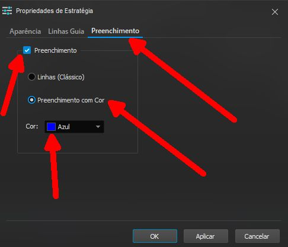

Fabio Mahfoud Cerdeira

cerdeira@yahoo.com

2022-03-16

# Cor entre 2 médias:

indicador muito simples apenas para exemplo de como colorir o espaço entre 2 médias no gráfico

# Regra:

Pode usar qualquer tipo de média (simples, exponencial, etc) e qualquer periodo.

Para colorir tem que entrar nas propriedades do indicador, clicar na aba "preenchimento", marcar a opção "preenchimento" e a opção "preenchimento com cor"

Dica: se deixar a cor no automático muitas vezes ela não aparece no gráfico quando o seu gráfico tem fundo preto ou o tema do seu profit for escuro.

# DISCLAIMER:

ESSES SETUPS NÃO SÃO RECOMENDAÇÃO DE COMPRA NEM DE VENDA.

SUA UTILIZAÇÃO É DE RESPONSABILIDADE SUA.

EU SOU TOTALMENTE CONTRA TESTAR SETUPS EM CONTAS COM DINHEIRO REAL.

